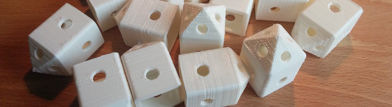
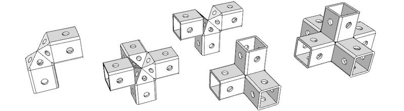

# Universal Vertex Module

The universal vertex module (UVM) allows to build complex structures by assembling them together. The vertices are assembled using cable ties at 90 degree angles. The connecting material between the vertices can be anything: wood, PVC piping, anything lying around...

## Examples

The main purpose of the UVM is to build custom light structures, intended for such applications as a furniture (closet, table...) or as a primary structure support. It's versatility allows to use it for a night stand the same way as for a small tool shack, or even a garage.

Only one design ensures consistency and modularity. Up to 5 modules can be assembled together, as at least one side must be left open so that the cable ties could be inserted and tightened.

## Parametric UVM

In order to accomodate most applications a parametric version of the UVM is available. It is written in JavaScript and can be viewed and optimised using the online tool [OpenJSCAD](http://openjscad.org). The tool also allows to export a 3D printable `.stl` files.

Simply drag and drop the `universal_vertex_module.jscad` file to the lower left corner of the tool, or alternativly [click this link to load it automatically](http://openjscad.org/#https://raw.githubusercontent.com/Nurgak/Universal-vertex-module/master/universal_vertex_module.jscad).

The parametric version allows to select a round or square hole for the connecting material, define connector size/diameter, module wall thickness and how deep the connecting module should go inside the UVM. The source code can be edited to accomodate more specific needs.

## Assembly

To assemble the UVMs simply run a cable tie through the pyramid-shaped part and tighten.

The lower part is intented for the connecting material, it can be any size, round or square (see parametric UVM). The UVM has holes on the sides, if the connecting material does not remain inside the UVM a hole can be drilled through the connecting material and a cable tie used to fix them together.

## 3D printing

An animation of 3 UVMs being printed on a Printrbot Simple 3D printer, in fast motion, [can be found here](http://www.gfycat.com/InstructiveShabbyGrub).
